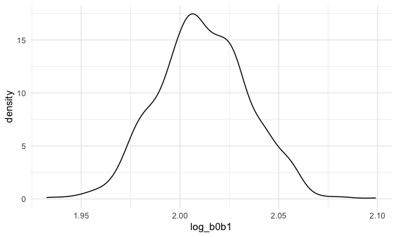

p8105_hw6_ys3508
================
2022-12-3

# HW6

install new package

``` r
# install.packages('leaps')
```

load library

``` r
library(tidyverse)
```

    ## ── Attaching packages ─────────────────────────────────────── tidyverse 1.3.2 ──
    ## ✔ ggplot2 3.3.6      ✔ purrr   0.3.4 
    ## ✔ tibble  3.1.8      ✔ dplyr   1.0.10
    ## ✔ tidyr   1.2.0      ✔ stringr 1.4.1 
    ## ✔ readr   2.1.2      ✔ forcats 0.5.2 
    ## ── Conflicts ────────────────────────────────────────── tidyverse_conflicts() ──
    ## ✖ dplyr::filter() masks stats::filter()
    ## ✖ dplyr::lag()    masks stats::lag()

``` r
library(viridis)
```

    ## Loading required package: viridisLite

``` r
library(purrr)
library(modelr)
library(leaps)


knitr::opts_chunk$set(
    echo = TRUE,
    warning = FALSE,
  fig.width = 6,
  fig.asp = .6,
  out.width = "90%"
)

theme_set(theme_minimal() + theme(legend.position = "bottom"))

options(
  ggplot2.continuous.colour = "viridis",
  ggplot2.continuous.fill = "viridis"
)

scale_colour_discrete = scale_colour_viridis_d
scale_fill_discrete = scale_fill_viridis_d
```

## Problem 1

``` r
weather_df = 
  rnoaa::meteo_pull_monitors(
    c("USW00094728"),
    var = c("PRCP", "TMIN", "TMAX"), 
    date_min = "2017-01-01",
    date_max = "2017-12-31") %>%
  mutate(
    name = recode(id, USW00094728 = "CentralPark_NY"),
    tmin = tmin / 10,
    tmax = tmax / 10) %>%
  select(name, id, everything())
```

    ## Registered S3 method overwritten by 'hoardr':
    ##   method           from
    ##   print.cache_info httr

    ## using cached file: ~/Library/Caches/R/noaa_ghcnd/USW00094728.dly

    ## date created (size, mb): 2022-10-04 23:26:41 (8.408)

    ## file min/max dates: 1869-01-01 / 2022-10-31

``` r
weather_df %>% 
  modelr::bootstrap(n = 1000) %>% 
  mutate(
    models = map(strap, ~lm(tmax ~ tmin, data = .x) ),
    results = map(models, broom::glance)) %>% 
  select(-strap, -models) %>% 
  unnest(results) %>% 
  ggplot(aes(x = r.squared)) + geom_density()
```


In this example, the $\hat{r}^2$ value is high, and the upper bound at 1
may be a cause for the generally skewed shape of the distribution. If we
wanted to construct a confidence interval for $R^2$, we could take the
2.5% and 97.5% quantiles of the estimates across bootstrap samples.
However, because the shape isn’t symmetric, using the mean +/- 1.96
times the standard error probably wouldn’t work well.

We can produce a distribution for $\log(\beta_0 * \beta1)$ using a
similar approach, with a bit more wrangling before we make our plot.

``` r
weather_df %>% 
  modelr::bootstrap(n = 1000) %>% 
  mutate(
    models = map(strap, ~lm(tmax ~ tmin, data = .x) ),
    results = map(models, broom::tidy)) %>% 
  select(-strap, -models) %>% 
  unnest(results) %>% 
  select(id = `.id`, term, estimate) %>% 
  pivot_wider(
    names_from = term, 
    values_from = estimate) %>% 
  rename(beta0 = `(Intercept)`, beta1 = tmin) %>% 
  mutate(log_b0b1 = log(beta0 * beta1)) %>% 
  ggplot(aes(x = log_b0b1)) + geom_density()
```



As with $r^2$, this distribution is somewhat skewed and has some
outliers.

The point of this is not to say you should always use the bootstrap –
it’s possible to establish “large sample” distributions for strange
parameters / values / summaries in a lot of cases, and those are great
to have. But it is helpful to know that there’s a way to do inference
even in tough cases.

## Problem 2

### Clean the dataset

``` r
# Import the dataset
homicide <- read_csv(url("https://raw.githubusercontent.com/washingtonpost/data-homicides/master/homicide-data.csv"), na = c("", "NA", "Unknown"))
```

    ## Rows: 52179 Columns: 12
    ## ── Column specification ────────────────────────────────────────────────────────
    ## Delimiter: ","
    ## chr (8): uid, victim_last, victim_first, victim_race, victim_sex, city, stat...
    ## dbl (4): reported_date, victim_age, lat, lon
    ## 
    ## ℹ Use `spec()` to retrieve the full column specification for this data.
    ## ℹ Specify the column types or set `show_col_types = FALSE` to quiet this message.

``` r
homicide = homicide %>%
  janitor::clean_names() %>%
  mutate(
    reported_date = as.Date(as.character(reported_date), format = "%Y%m%d"),
    city_state = str_c(city, ", ", state),
    victim_race = fct_relevel(victim_race, "White"),
    victim_age = as.numeric(victim_age),
    status = case_when(
      disposition == "Closed by arrest"      ~ 0,
      disposition == "Closed without arrest" ~ 0,
      disposition == "Open/No arrest"        ~ 1,
)
  ) %>% 
  filter(!city_state %in% c("Dallas, TX","Phoenix, AZ","Kansas City, MO","Tulsa, AL"),
  victim_race %in% c("White","Black"))
```

### Fit a logistic regression

``` r
logistic = homicide %>%
    filter(city_state == "Baltimore, MD") %>% 
    glm(status ~ victim_age + victim_race + victim_sex, data = ., family = "binomial") 
    
logistic %>% 
    broom::tidy() %>% 
  mutate(OR = exp(estimate),
         CI_lower = exp(estimate - 1.96 * std.error),
         CI_upper = exp(estimate + 1.96 * std.error)) %>% 
  select(term, estimate, OR, CI_lower,CI_upper) %>% 
  knitr::kable(digits = 3, 
        col.names = c("Term", "Log(OR)", "Estimated adjusted OR", "CI lower bound", "CI upper bound"))
```

| Term             | Log(OR) | Estimated adjusted OR | CI lower bound | CI upper bound |
|:-----------------|--------:|----------------------:|---------------:|---------------:|
| (Intercept)      |  -1.564 |                 0.209 |          0.130 |          0.338 |
| victim_age       |   0.005 |                 1.005 |          0.999 |          1.012 |
| victim_raceBlack |   0.900 |                 2.459 |          1.727 |          3.501 |
| victim_sexMale   |   1.037 |                 2.820 |          2.132 |          3.729 |

### Nesting city

``` r
nest_city = homicide %>%  
  nest(df = -city_state) %>% 
  mutate(models = map(.x = df, ~ glm(status ~ victim_age + victim_race + victim_sex, data = .x, family = "binomial")),
    results = map(models, broom::tidy)) %>% 
  select(city_state, results) %>% 
   unnest(results) %>% 
  mutate(OR = exp(estimate),
         CI_lower = exp(estimate - 1.96 * std.error),
         CI_upper = exp(estimate + 1.96 * std.error)) %>% 
  filter(term == "victim_sexMale") %>% 
  select(city_state, OR, CI_lower,CI_upper)

nest_city %>% 
  knitr::kable(digits = 3, 
        col.names = c("Term", "Estimated adjusted OR", "CI lower bound", "CI upper bound")) 
```

| Term               | Estimated adjusted OR | CI lower bound | CI upper bound |
|:-------------------|----------------------:|---------------:|---------------:|
| Albuquerque, NM    |                 2.325 |          0.798 |          6.773 |
| Atlanta, GA        |                 1.953 |          1.251 |          3.048 |
| Baltimore, MD      |                 2.820 |          2.132 |          3.729 |
| Baton Rouge, LA    |                 3.137 |          1.635 |          6.020 |
| Birmingham, AL     |                 1.420 |          0.907 |          2.225 |
| Boston, MA         |                 1.499 |          0.794 |          2.829 |
| Buffalo, NY        |                 2.282 |          1.256 |          4.146 |
| Charlotte, NC      |                 3.324 |          1.672 |          6.611 |
| Chicago, IL        |                 2.559 |          2.101 |          3.116 |
| Cincinnati, OH     |                 4.866 |          2.453 |          9.653 |
| Columbus, OH       |                 2.774 |          1.891 |          4.068 |
| Denver, CO         |                 5.359 |          1.983 |         14.483 |
| Detroit, MI        |                 1.811 |          1.437 |          2.283 |
| Durham, NC         |                 2.222 |          0.952 |          5.187 |
| Fort Worth, TX     |                 2.845 |          1.567 |          5.166 |
| Fresno, CA         |                 0.886 |          0.370 |          2.119 |
| Houston, TX        |                 1.839 |          1.406 |          2.404 |
| Indianapolis, IN   |                 1.763 |          1.260 |          2.468 |
| Jacksonville, FL   |                 1.810 |          1.313 |          2.495 |
| Las Vegas, NV      |                 2.812 |          1.863 |          4.245 |
| Long Beach, CA     |                 6.060 |          1.374 |         26.723 |
| Los Angeles, CA    |                 1.511 |          1.046 |          2.183 |
| Louisville, KY     |                 2.039 |          1.266 |          3.282 |
| Memphis, TN        |                 2.059 |          1.446 |          2.932 |
| Miami, FL          |                 2.797 |          1.618 |          4.835 |
| Milwaukee, wI      |                 1.898 |          1.254 |          2.874 |
| Minneapolis, MN    |                 0.930 |          0.466 |          1.856 |
| Nashville, TN      |                 1.466 |          0.916 |          2.346 |
| New Orleans, LA    |                 2.412 |          1.736 |          3.351 |
| New York, NY       |                 6.199 |          2.859 |         13.439 |
| Oakland, CA        |                 1.776 |          1.151 |          2.739 |
| Oklahoma City, OK  |                 1.100 |          0.702 |          1.725 |
| Omaha, NE          |                 2.793 |          1.449 |          5.381 |
| Philadelphia, PA   |                 3.085 |          2.258 |          4.215 |
| Pittsburgh, PA     |                 2.322 |          1.429 |          3.772 |
| Richmond, VA       |                 2.175 |          0.872 |          5.423 |
| San Antonio, TX    |                 3.475 |          1.609 |          7.504 |
| Sacramento, CA     |                 2.964 |          1.252 |          7.018 |
| Savannah, GA       |                 1.850 |          0.866 |          3.952 |
| San Bernardino, CA |                 2.628 |          0.839 |          8.231 |
| San Diego, CA      |                 5.168 |          1.758 |         15.189 |
| San Francisco, CA  |                 1.646 |          0.858 |          3.157 |
| St. Louis, MO      |                 1.773 |          1.330 |          2.363 |
| Stockton, CA       |                 0.948 |          0.433 |          2.078 |
| Tampa, FL          |                 1.815 |          0.740 |          4.449 |
| Tulsa, OK          |                 1.423 |          0.812 |          2.495 |
| Washington, DC     |                 2.119 |          1.369 |          3.279 |

### Plot that shows the estimated ORs and CIs

``` r
plot1 <-nest_city %>% 
  mutate(city_state = fct_reorder(city_state, OR)) %>%
  ggplot(aes(x = city_state, y = OR)) +
  geom_point() +
  geom_errorbar(aes(ymin = CI_lower, ymax = CI_upper)) +
  labs(x = "City and state", 
       y = "Estimated OR with CI",
       title = "Solving homicides comparing male victims to female victims in each city \nEstimated Adjusted OR with 95% CI") +
  theme(axis.text.x = element_text(angle = 80, hjust = 1))

plot1
```


``` r
ggsave(
  plot1,
  filename = "figures/plot1.png")
```

    ## Saving 6 x 3.6 in image

## Problem 3

### Load and clean data

``` r
birthweight = read_csv("./data/birthweight.csv")
```

    ## Rows: 4342 Columns: 20
    ## ── Column specification ────────────────────────────────────────────────────────
    ## Delimiter: ","
    ## dbl (20): babysex, bhead, blength, bwt, delwt, fincome, frace, gaweeks, malf...
    ## 
    ## ℹ Use `spec()` to retrieve the full column specification for this data.
    ## ℹ Specify the column types or set `show_col_types = FALSE` to quiet this message.

``` r
birthweight <- birthweight %>% 
  janitor::clean_names() %>%
  mutate(babyset = as.factor(babysex),
         frace = as.factor(frace),
         malform = as.factor(malform),
         mrace = as.factor(mrace)) %>% 
  mutate(babysex = recode(babysex, "1" = "male", "2" = "female"),
         frace = recode(frace, 
                        "1" = "White", 
                        "2" = "Black", 
                        "3" = "Asian", 
                        "4" = "Puerto Rican", 
                        "8" = "Other", 
                        "9" = "Unknown"),
         malform = recode(malform, "0" = "absent", "1" = "present"),
         mrace = recode(mrace, 
                        "1" = "White", 
                        "2" = "Black", 
                        "3" = "Asian", 
                        "4" = "Puerto Rican", 
                        "8" = "Other"))
```

check nas

``` r
sum(is.na(birthweight))
```

    ## [1] 0

### Building linear regression model

**Step 1: Perform linear regression with all predictors**

``` r
lm1 <- lm(bwt ~ ., data = birthweight)
summary(lm1)
```

    ## 
    ## Call:
    ## lm(formula = bwt ~ ., data = birthweight)
    ## 
    ## Residuals:
    ##      Min       1Q   Median       3Q      Max 
    ## -1097.68  -184.86    -3.33   173.09  2344.15 
    ## 
    ## Coefficients: (4 not defined because of singularities)
    ##                     Estimate Std. Error t value Pr(>|t|)    
    ## (Intercept)       -6236.6841   660.1884  -9.447  < 2e-16 ***
    ## babysexmale         -28.7073     8.4652  -3.391 0.000702 ***
    ## bhead               130.7781     3.4523  37.881  < 2e-16 ***
    ## blength              74.9536     2.0217  37.075  < 2e-16 ***
    ## delwt                 4.1007     0.3948  10.386  < 2e-16 ***
    ## fincome               0.2898     0.1795   1.614 0.106551    
    ## fraceBlack           14.3313    46.1501   0.311 0.756168    
    ## fraceAsian           21.2361    69.2960   0.306 0.759273    
    ## fracePuerto Rican   -46.9962    44.6782  -1.052 0.292912    
    ## fraceOther            4.2969    74.0741   0.058 0.953745    
    ## gaweeks              11.5494     1.4654   7.882 4.06e-15 ***
    ## malformpresent        9.7650    70.6259   0.138 0.890039    
    ## menarche             -3.5508     2.8951  -1.226 0.220083    
    ## mheight               9.7874    10.3116   0.949 0.342588    
    ## momage                0.7593     1.2221   0.621 0.534418    
    ## mraceBlack         -151.4354    46.0453  -3.289 0.001014 ** 
    ## mraceAsian          -91.3866    71.9190  -1.271 0.203908    
    ## mracePuerto Rican   -56.4787    45.1369  -1.251 0.210901    
    ## parity               95.5411    40.4793   2.360 0.018307 *  
    ## pnumlbw                   NA         NA      NA       NA    
    ## pnumsga                   NA         NA      NA       NA    
    ## ppbmi                 4.3538    14.8913   0.292 0.770017    
    ## ppwt                 -3.4716     2.6121  -1.329 0.183913    
    ## smoken               -4.8544     0.5871  -8.269  < 2e-16 ***
    ## wtgain                    NA         NA      NA       NA    
    ## babyset2                  NA         NA      NA       NA    
    ## ---
    ## Signif. codes:  0 '***' 0.001 '**' 0.01 '*' 0.05 '.' 0.1 ' ' 1
    ## 
    ## Residual standard error: 272.5 on 4320 degrees of freedom
    ## Multiple R-squared:  0.7183, Adjusted R-squared:  0.717 
    ## F-statistic: 524.6 on 21 and 4320 DF,  p-value: < 2.2e-16

With all of our variables included in the model, the base adjusted r² is
0.717 and the Residual Standard Error is 272.5. This relationship is
significant at the P\<.05 level.

**Step 2: Run the `regsubsets()` function on all variables**

``` r
best_predictors <-
    regsubsets(bwt ~.,
               data = birthweight,
               nbest = 1,      # 1 best model for each number of predictors
               nvmax = NULL,    # NULL for no limit on number of variables
               force.in = NULL, force.out = NULL,
               method = "exhaustive")
```

    ## Reordering variables and trying again:

``` r
summary_best_predictors <- summary(best_predictors)
```

**Step 3: Choose number of predictors**

``` r
which.max(summary_best_predictors$adjr2)
```

    ## [1] 15

**Step 4: Choose best predictors**

``` r
summary_best_predictors$which[15,]
```

    ##       (Intercept)       babysexmale             bhead           blength 
    ##              TRUE              TRUE              TRUE              TRUE 
    ##             delwt           fincome        fraceBlack        fraceAsian 
    ##             FALSE              TRUE             FALSE             FALSE 
    ## fracePuerto Rican        fraceOther           gaweeks    malformpresent 
    ##              TRUE             FALSE              TRUE             FALSE 
    ##          menarche           mheight            momage        mraceBlack 
    ##              TRUE              TRUE             FALSE              TRUE 
    ##        mraceAsian mracePuerto Rican            parity           pnumlbw 
    ##              TRUE              TRUE              TRUE             FALSE 
    ##           pnumsga             ppbmi              ppwt            smoken 
    ##             FALSE              TRUE             FALSE              TRUE 
    ##            wtgain          babyset2 
    ##              TRUE             FALSE

The best model fit for linear regression model:`babysexmale`, `bhead`,
`blength`,
`fincome`,`gaweeks`,`menarche`,`mheigh`,`mrace`,`parity`,`ppbmi`,`smoken`,`wtgain`

**Step 5: Run the regression model with the best predictors**

``` r
best_model = lm(bwt ~  babysex + bhead + blength + fincome + gaweeks + mheight + mrace + parity + ppbmi + smoken + wtgain,
              data=birthweight)
summary(best_model)
```

    ## 
    ## Call:
    ## lm(formula = bwt ~ babysex + bhead + blength + fincome + gaweeks + 
    ##     mheight + mrace + parity + ppbmi + smoken + wtgain, data = birthweight)
    ## 
    ## Residuals:
    ##      Min       1Q   Median       3Q      Max 
    ## -1100.07  -185.18    -3.59   174.07  2353.50 
    ## 
    ## Coefficients:
    ##                     Estimate Std. Error t value Pr(>|t|)    
    ## (Intercept)       -6428.4260   135.8975 -47.304  < 2e-16 ***
    ## babysexmale         -28.6023     8.4547  -3.383 0.000723 ***
    ## bhead               130.7253     3.4471  37.923  < 2e-16 ***
    ## blength              74.9442     2.0191  37.118  < 2e-16 ***
    ## fincome               0.3158     0.1747   1.807 0.070835 .  
    ## gaweeks              11.5983     1.4620   7.933 2.70e-15 ***
    ## mheight              12.2403     1.6431   7.450 1.12e-13 ***
    ## mraceBlack         -138.8055     9.9071 -14.011  < 2e-16 ***
    ## mraceAsian          -73.7032    42.3305  -1.741 0.081731 .  
    ## mracePuerto Rican  -100.2662    19.3235  -5.189 2.21e-07 ***
    ## parity               96.6171    40.3359   2.395 0.016649 *  
    ## ppbmi                 8.2566     1.3366   6.177 7.12e-10 ***
    ## smoken               -4.8395     0.5855  -8.265  < 2e-16 ***
    ## wtgain                4.1081     0.3921  10.478  < 2e-16 ***
    ## ---
    ## Signif. codes:  0 '***' 0.001 '**' 0.01 '*' 0.05 '.' 0.1 ' ' 1
    ## 
    ## Residual standard error: 272.3 on 4328 degrees of freedom
    ## Multiple R-squared:  0.7181, Adjusted R-squared:  0.7173 
    ## F-statistic: 848.1 on 13 and 4328 DF,  p-value: < 2.2e-16

However, this model is chasing data points and will change a lot from
one training dataset to the the next – it will be consistently wrong due
to its complexity, and is therefore highly variable.

**Step 6: Modify the best model based on factors that underly
birthweight** Choose predictors based on common sense and knowledges
about birthweight from the `best_model`

``` r
linear = lm(bwt ~  bhead + blength + gaweeks + mrace + parity + ppbmi + smoken,
              data=birthweight)
summary(linear)
```

    ## 
    ## Call:
    ## lm(formula = bwt ~ bhead + blength + gaweeks + mrace + parity + 
    ##     ppbmi + smoken, data = birthweight)
    ## 
    ## Residuals:
    ##      Min       1Q   Median       3Q      Max 
    ## -1130.50  -185.59    -6.71   178.26  2404.48 
    ## 
    ## Coefficients:
    ##                     Estimate Std. Error t value Pr(>|t|)    
    ## (Intercept)       -5804.1300   100.2498 -57.897  < 2e-16 ***
    ## bhead               133.0609     3.4587  38.471  < 2e-16 ***
    ## blength              78.3887     2.0361  38.500  < 2e-16 ***
    ## gaweeks              13.1268     1.4796   8.872  < 2e-16 ***
    ## mraceBlack         -141.9842     9.3846 -15.130  < 2e-16 ***
    ## mraceAsian         -106.6034    43.0639  -2.475 0.013344 *  
    ## mracePuerto Rican  -137.1198    18.9922  -7.220 6.12e-13 ***
    ## parity              105.0563    41.1223   2.555 0.010661 *  
    ## ppbmi                 5.2214     1.3416   3.892 0.000101 ***
    ## smoken               -4.3951     0.5949  -7.388 1.77e-13 ***
    ## ---
    ## Signif. codes:  0 '***' 0.001 '**' 0.01 '*' 0.05 '.' 0.1 ' ' 1
    ## 
    ## Residual standard error: 277.9 on 4332 degrees of freedom
    ## Multiple R-squared:  0.7062, Adjusted R-squared:  0.7056 
    ## F-statistic:  1157 on 9 and 4332 DF,  p-value: < 2.2e-16

### plot of model residuals against fitted values

``` r
plot2 <- birthweight %>%
  add_predictions(linear) %>% 
  add_residuals(linear) %>% 
  ggplot(aes(x = pred, y = resid)) +
  geom_point() +
  geom_line(aes(y = resid), color = "red")+
  labs(
    x = "Fitted value",
    y = "Residuals",
    lines = "Residuals",
    title = "Residuals vs Fitted Values in Birth Weight Model"
  )

plot2
```


``` r
ggsave(
  plot2,
  filename = "figures/plot2.png")
```

    ## Saving 6 x 3.6 in image

### Cross validation

``` r
cv_df = 
  crossv_mc(birthweight, 100) %>% 
    mutate(
        train = map(train, as_tibble),
        test = map(test,as_tibble)
    )  %>%
  mutate(
    my_model_fit  = map(train, ~lm(bwt ~  bhead + blength + gaweeks + mrace + parity + ppbmi + smoken,
                                 data = birthweight)),
    model1_fit  = map(train, ~lm(bwt ~ blength + gaweeks, data = birthweight)),
    model2_fit  = map(train, ~lm(bwt ~ blength + bhead + babysex + blength*bhead + blength* babysex + bhead*babysex + blength*bhead*babysex, data = birthweight))) %>% 
  mutate(
    rmse_my_model = map2_dbl(my_model_fit, test, ~rmse(model = .x, data = .y)),
    rmse_model1 = map2_dbl(model1_fit , test, ~rmse(model = .x, data = .y)),
    rmse_model2 = map2_dbl(model2_fit, test, ~rmse(model = .x, data = .y))) 
```

### Comparison among 3 models

``` r
plot3 <- cv_df %>% 
  select(starts_with("rmse")) %>% 
  pivot_longer(
    everything(),
    names_to = "model",
    names_prefix = "rmse_",
    values_to = "rmse"
  ) %>% 
  mutate(
    model = fct_inorder(model)
  ) %>% 
  ggplot(aes(x = model, y = rmse)) +
  geom_boxplot() +
  labs(
    x = "Model",
    y = "RMSE",
    title = "Comparsion among 3 models"
  ) 

plot3
```


``` r
ggsave(
  plot3,
  filename = "figures/plot3.png")
```

    ## Saving 6 x 3.6 in image
