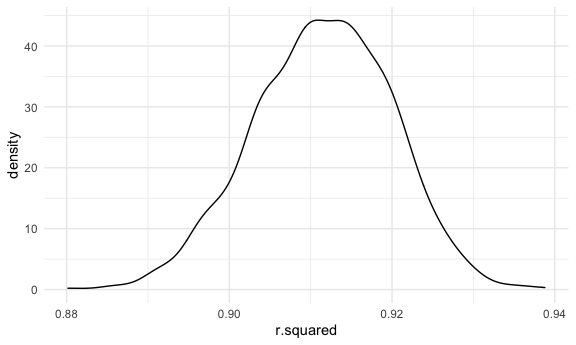

p8105_hw6_ys3508
================
2022-12-3

# HW6

``` r
library(tidyverse)
```

    ## ── Attaching packages ─────────────────────────────────────── tidyverse 1.3.2 ──
    ## ✔ ggplot2 3.3.6      ✔ purrr   0.3.4 
    ## ✔ tibble  3.1.8      ✔ dplyr   1.0.10
    ## ✔ tidyr   1.2.0      ✔ stringr 1.4.1 
    ## ✔ readr   2.1.2      ✔ forcats 0.5.2 
    ## ── Conflicts ────────────────────────────────────────── tidyverse_conflicts() ──
    ## ✖ dplyr::filter() masks stats::filter()
    ## ✖ dplyr::lag()    masks stats::lag()

``` r
library(viridis)
```

    ## Loading required package: viridisLite

``` r
library(purrr)
library(modelr)


knitr::opts_chunk$set(
    echo = TRUE,
    warning = FALSE,
  fig.width = 6,
  fig.asp = .6,
  out.width = "90%"
)

theme_set(theme_minimal() + theme(legend.position = "bottom"))

options(
  ggplot2.continuous.colour = "viridis",
  ggplot2.continuous.fill = "viridis"
)

scale_colour_discrete = scale_colour_viridis_d
scale_fill_discrete = scale_fill_viridis_d
```

## Problem 1

``` r
weather_df = 
  rnoaa::meteo_pull_monitors(
    c("USW00094728"),
    var = c("PRCP", "TMIN", "TMAX"), 
    date_min = "2017-01-01",
    date_max = "2017-12-31") %>%
  mutate(
    name = recode(id, USW00094728 = "CentralPark_NY"),
    tmin = tmin / 10,
    tmax = tmax / 10) %>%
  select(name, id, everything())
```

    ## Registered S3 method overwritten by 'hoardr':
    ##   method           from
    ##   print.cache_info httr

    ## using cached file: ~/Library/Caches/R/noaa_ghcnd/USW00094728.dly

    ## date created (size, mb): 2022-10-04 23:26:41 (8.408)

    ## file min/max dates: 1869-01-01 / 2022-10-31

``` r
weather_df %>% 
  modelr::bootstrap(n = 1000) %>% 
  mutate(
    models = map(strap, ~lm(tmax ~ tmin, data = .x) ),
    results = map(models, broom::glance)) %>% 
  select(-strap, -models) %>% 
  unnest(results) %>% 
  ggplot(aes(x = r.squared)) + geom_density()
```



In this example, the $\hat{r}^2$ value is high, and the upper bound at 1
may be a cause for the generally skewed shape of the distribution. If we
wanted to construct a confidence interval for $R^2$, we could take the
2.5% and 97.5% quantiles of the estimates across bootstrap samples.
However, because the shape isn’t symmetric, using the mean +/- 1.96
times the standard error probably wouldn’t work well.

We can produce a distribution for $\log(\beta_0 * \beta1)$ using a
similar approach, with a bit more wrangling before we make our plot.

``` r
weather_df %>% 
  modelr::bootstrap(n = 1000) %>% 
  mutate(
    models = map(strap, ~lm(tmax ~ tmin, data = .x) ),
    results = map(models, broom::tidy)) %>% 
  select(-strap, -models) %>% 
  unnest(results) %>% 
  select(id = `.id`, term, estimate) %>% 
  pivot_wider(
    names_from = term, 
    values_from = estimate) %>% 
  rename(beta0 = `(Intercept)`, beta1 = tmin) %>% 
  mutate(log_b0b1 = log(beta0 * beta1)) %>% 
  ggplot(aes(x = log_b0b1)) + geom_density()
```


As with $r^2$, this distribution is somewhat skewed and has some
outliers.

The point of this is not to say you should always use the bootstrap –
it’s possible to establish “large sample” distributions for strange
parameters / values / summaries in a lot of cases, and those are great
to have. But it is helpful to know that there’s a way to do inference
even in tough cases.

## Problem 2

### Clean the dataset

``` r
# Import the dataset
homicide <- read_csv(url("https://raw.githubusercontent.com/washingtonpost/data-homicides/master/homicide-data.csv"), na = c("", "NA", "Unknown"))
```

    ## Rows: 52179 Columns: 12
    ## ── Column specification ────────────────────────────────────────────────────────
    ## Delimiter: ","
    ## chr (8): uid, victim_last, victim_first, victim_race, victim_sex, city, stat...
    ## dbl (4): reported_date, victim_age, lat, lon
    ## 
    ## ℹ Use `spec()` to retrieve the full column specification for this data.
    ## ℹ Specify the column types or set `show_col_types = FALSE` to quiet this message.

``` r
homicide = homicide %>%
  janitor::clean_names() %>%
  mutate(
    reported_date = as.Date(as.character(reported_date), format = "%Y%m%d"),
    city_state = str_c(city, ", ", state),
    victim_race = fct_relevel(victim_race, "White"),
    victim_age = as.numeric(victim_age),
    status = case_when(
      disposition == "Closed by arrest"      ~ 0,
      disposition == "Closed without arrest" ~ 0,
      disposition == "Open/No arrest"        ~ 1,
)
  ) %>% 
  filter(!city_state %in% c("Dallas, TX","Phoenix, AZ","Kansas City, MO","Tulsa, AL"),
  victim_race %in% c("White","Black"))
```

### Fit a logistic regression

``` r
logistic = homicide %>%
    filter(city_state == "Baltimore, MD") %>% 
    glm(status ~ victim_age + victim_race + victim_sex, data = ., family = "binomial") 
    
logistic %>% 
    broom::tidy(conf.int = T) %>% 
  mutate(OR = exp(estimate),
         CI_lower = exp(exp(conf.low)),
         CI_upper = exp(exp(conf.high))) %>% 
  select(term, estimate, OR, CI_lower,CI_upper) %>% 
  knitr::kable(digits = 3, 
        col.names = c("Term", "Log(OR)", "Estimated adjusted OR", "CI lower bound", "CI upper bound"))
```

| Term             | Log(OR) | Estimated adjusted OR | CI lower bound | CI upper bound |
|:-----------------|--------:|----------------------:|---------------:|---------------:|
| (Intercept)      |  -1.564 |                 0.209 |          1.137 |          1.400 |
| victim_age       |   0.005 |                 1.005 |          2.715 |          2.750 |
| victim_raceBlack |   0.900 |                 2.459 |          5.658 |         33.742 |
| victim_sexMale   |   1.037 |                 2.820 |          8.475 |         42.165 |

``` r
homicide %>%  
  nest(df = -city_state) %>% 
  mutate(models = map(.x = df, ~ glm(status ~ victim_age + victim_race + victim_sex, data = .x, family = "binomial")),
    results = map(models, broom::tidy)) %>% 
  select(city_state, results) %>% 
   unnest(results)  
```

    ## # A tibble: 188 × 6
    ##    city_state      term             estimate std.error statistic  p.value
    ##    <chr>           <chr>               <dbl>     <dbl>     <dbl>    <dbl>
    ##  1 Albuquerque, NM (Intercept)      -2.64      0.712      -3.70  2.12e- 4
    ##  2 Albuquerque, NM victim_age        0.0137    0.0110      1.24  2.13e- 1
    ##  3 Albuquerque, NM victim_raceBlack  0.503     0.448       1.12  2.61e- 1
    ##  4 Albuquerque, NM victim_sexMale    0.844     0.546       1.55  1.22e- 1
    ##  5 Atlanta, GA     (Intercept)      -1.92      0.400      -4.81  1.49e- 6
    ##  6 Atlanta, GA     victim_age        0.0114    0.00489     2.32  2.03e- 2
    ##  7 Atlanta, GA     victim_raceBlack  0.207     0.302       0.686 4.93e- 1
    ##  8 Atlanta, GA     victim_sexMale    0.669     0.227       2.95  3.22e- 3
    ##  9 Baltimore, MD   (Intercept)      -1.56      0.245      -6.38  1.75e-10
    ## 10 Baltimore, MD   victim_age        0.00520   0.00325     1.60  1.10e- 1
    ## # … with 178 more rows
